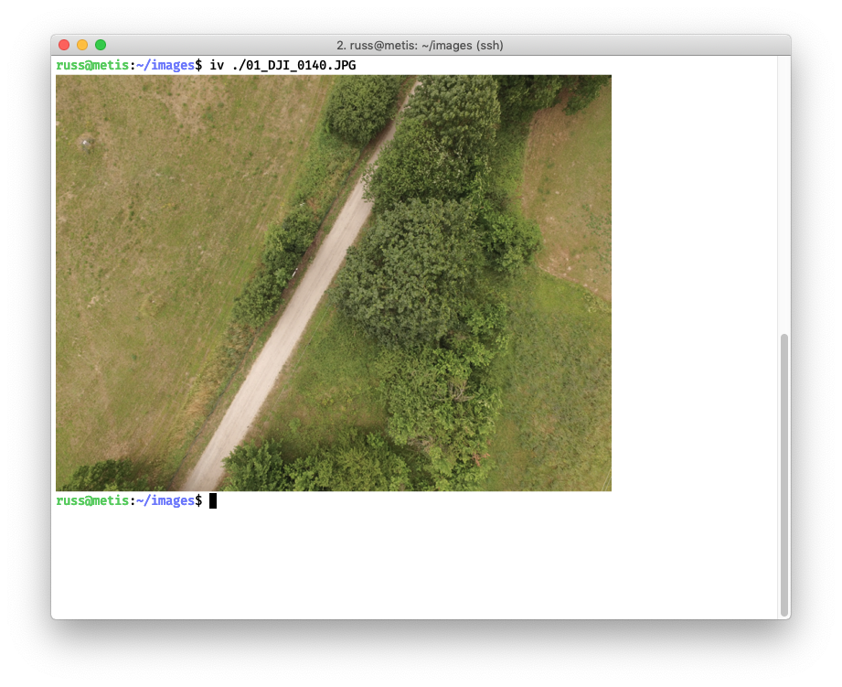
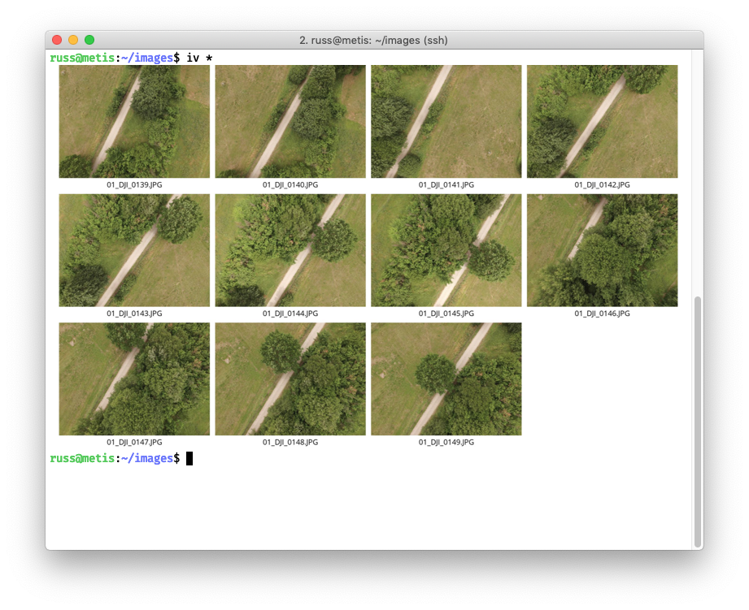

# iv: Terminal Image Viewer for iTerm2

`iv` is a utility for viewing images in the terminal using iTerm2's [image display capability](https://www.iterm2.com/documentation-images.html). It's useful for dealing with images on a remote server, for example with large image processing tasks.

When displaying single images, `iv` will resize them to speed up
transfer over an SSH connection:



When displaying multiple images, `iv` will produce a "contact sheet"
of images with filenames:



## Installation

`iv` can be installed using pip:

	$ pip3 install iv

## Usage
```
Usage: iv [OPTIONS] FILENAME...

  Display images within an iTerm2 terminal.

  iv will resize images to reduce the time taken to display them over SSH
  connections, and it will combine multiple images into a single image, with
  filenames.

  Usage:

    iv ./file.jpg # Display a single file, resizing as appropriate.
    iv *.jpg      # Display a number of files combined into a single image, with filenames.

  The IV_SIZE environment variable can be used to set the output image size
  instead of the -s/--size option.

Options:
  --version           Show the version and exit.
  -s, --size INTEGER  Maximum output image width in pixels.
  --help              Show this message and exit.
```
## Limitations

iTerm2 has some image resizing logic which means that increasing the displayed
width may actually decrease the size of the image. This seems to be partly
dependent on terminal dimensions.

iTerm2 may refuse to display extremely large images, and replace them with an
extremely retro "broken image" icon.
